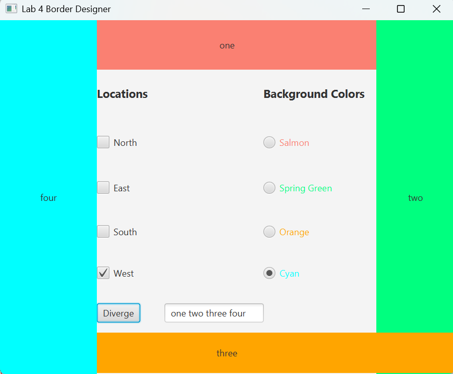

# JavaFX Border Designer

A simple JavaFX GUI application that allows users to customize border labels.

## Features
- Select border locations (North, East, South, West)
- Choose background colors using radio buttons
- Enter four words to update the border labels
- Built using JavaFX and FXML

## Screenshot

## Technologies
- Java
- JavaFX
- FXML

Author: Donggeon Lim
